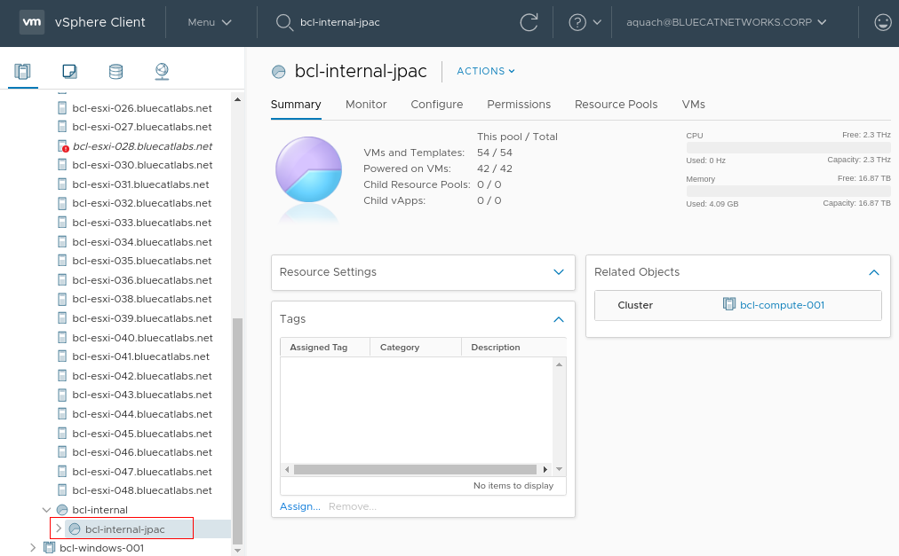

# DEVELOPMENT

<details open="open">
  <summary>
    <h2 style="display: inline-block">Table of Contents</h2>
  </summary>
  <ol>
    <li>
      <a href="#about">About</a>
    </li>
    <li>
      <a href="#configure-ci-deployment">Setup Vcenter</a>
      <ul>
        <li><a href="#configure-vcenter-credential">Configure Vcenter Credential</a></li>
      </ul>
    </li>
   <li>
      <a href="#setup-bam-data">Setup BAM Data</a>
      <ul>
        <li><a href="#configure-config.ini">Configure Config File</a></li>
        <li><a href="#configure-builtin.ini">Configure Builtin File</a></li>
      </ul>
    </li>
    <li>
      <a href="#configure-ci-deployment">Setup DDS Data</a>
      <ul>
        <li><a href="#configure-config-file">Configure Config File</a></li>
        <li><a href="#configure-builtin-file">Configure Builtin File</a></li>
        <li><a href="#configure-alarm-file">Configure Alarm Inject File</a></li>
        <li><a href="#setup-docker-images">Setup Docker Images</a></li>
      </ul>
    </li>
  </ol>
</details>

## ============================

## About

## ============================

Support setup aid development BAM and DDS for CI.

## ============================

## <div style="text-transform:uppercase"> Setup VCenter </div>

## ============================

### Configure Vcenter Credential

Modify correct value:

1. In `development/configs/credential_conf.json`, input the host and port of your Vcenter app \

```
{ 
    "host" : "<host of your vcenter app>", 
    "port": "<port of your vcenter app>",  
    "ssl": null                            
} 
```

2. In `development/configs/vcenter_conf.json`:

```
Example:
{ 
    "datacenter_name" : "CEL",
    "datastore_name" :"BCL-SIO-VOL-JPAC-101", 
    "resource_pool_name" : "bcl-internal-jpac" 
}
```

3. In Gitlab CI variables:
    - Set up Vcenter user and password:

    * Go to Setting
      
    * And add 2 environment variables:
        ```
          VCENTER_USERNAME: username of your Vcenter account
          VCENTER_PASSWORD: password of your Vcenter account
        ``` 
      

    * Data Center Name: Your data center name (relative name, for ex CEL)
      
    *
    * Data Store Name: Your data store name (relative name, for ex BCL-SIO-VOL-JPAC-101)
      
    *
    * Resource Pool Name: Your resource pool name (relative name, for ex bcl-internal-jpac)
      

4. Setup VM clone path and default password in `development/common/constant.py`:
    ```
       VCENTER_TEMPLATE = ‘<VM template dir>’ 
       VCENTER_CLONE_PATH = ‘<VM destination dir’> 
       
       Ex: Tenants-Internal/JPAC/Templates/BETA/
    ```
   Specify the absolute path name from your data center's root (at 1):

   

   Then in this folder put the 2 templates
    ```
    DDS_VERSION = ‘[path to bdds template]’ 
    BAM_VERSION = ‘[path to bam template]’ 
    ```
   Note: the deployment script expects BAM and BDDS to be in the same folder.

   ** Input source: (template to clone vm)
    ```
    VCENTER_TEMPLATE/DDS_VERSION 
    VCENTER_TEMPLATE/BAM_VERSION 
    ```
   ** Output source: (template to store output vm)
    ```
    VCENTER_CLONE_PATH/DDS_VERSION 
    VCENTER_CLONE_PATH/BAM_VERSION 
    ```

## ============================

## <div style="text-transform:uppercase"> Setup BAM Data </div>

## ============================
### Configure Config File
Modify correct value in `development/configs/bam_data/config.ini`:
   ```
    Example:
        vm_name=vBLUECAT_vBLUECAT_0001_BAM_0001
        # Total number of BAM:
        bam_num=1
        # If number of BAM=1, then the DDS will start from no 2
        LOCAL_V4_DHCP=yes
        LOCAL_V6_0001=fdac:1400::0220
        LOCAL_V6_0002=fdac:1400::0221
        ...
        LOCAL_V6_PREFIX=64
        OM_V6_0001=fdac:1500::0220
        OM_V6_0002=fdac:1500::0221
        ...
        OM_V6_PREFIX=64
        # Only DDS has a service interface; numbering starts from 1
        SERVER_V6_0001=fdac:1600::0221
        SERVER_V6_0002=fdac:1600::0222
        ...
        SERVER_V6_PREFIX=64
        syslog_host1=fdac:1400::10
        timezone=Asia/Shanghai
        route1_gateway=189.105.11.2
        route1_network=189.105.11.0/24
        nameserver1=8.8.8.8
        snmp_trap_hosts=fdac:1400::3,fdac:1400::4,fdac:1400::5
        firewall_localif_v4net_1=192.168.16.0/24
        firewall_localif_v6net_1=fdac:1400::0/120
   ```

### Configure Builtin File
Modify correct value in `development/configs/bam_data/builtin.ini`:
   ```
    x_snmp_privphrase=<encypted-privphrase>
    snmp_privtype=DES
    x_snmp_authphrase=<encypted-authphrase>
    snmp_authtype=SHA
    x_bluecat_password=<encypted-password>
    vmse_admin_ssh_key=ssh-rsa <encypted-ssh-password>
    x_clientid=<encypted-client-id>
    x_license_key=<encypted-client-key>
    stig_compliance=<yes/no>
   ```
> Note: <br>
> Configure BAM new root password in `x_password=<your new BAM root password`

## ============================

## <div style="text-transform:uppercase"> Setup DDS Data </div>

## ============================

### Configure Config File
Modify correct value in `development/configs/dds_data/config.ini`:
   ```
    Example:
        vm_name=vBLUECAT_vBLUECAT_0001_DDS_0001
        # Total number of BAM:
        bam_num=1
        # If number of BAM=1, then the DDS will start from no 2
        LOCAL_V4_DHCP=yes
        LOCAL_V6_0001=fdac:1400::0220
        LOCAL_V6_0002=fdac:1400::0221
        ...
        LOCAL_V6_PREFIX=64
        OM_V6_0001=fdac:1500::0220
        OM_V6_0002=fdac:1500::0221
        ...
        OM_V6_PREFIX=64
        # Only DDS has a service interface; numbering starts from 1
        SERVER_V6_0001=fdac:1600::0221
        SERVER_V6_0002=fdac:1600::0222
        ...
        SERVER_V6_PREFIX=64
        timezone=Asia/Shanghai
        route1_gateway=172.16.16.2
        route1_network=189.105.11.0/24
        nameserver1=8.8.8.8
        snmp_trap_hosts=fdac:1400::3,fdac:1400::4,fdac:1400::5
        firewall_localif_v4net_1=192.168.16.0/24
        firewall_localif_v6net_1=fdac:1400::0/120
        monitored_dns_servers=8.8.8.8,8.8.4.4
        monitored_domain=www.example.com
        syslog_mon_trap_hosts=fdac:1400::13,fdac:1400::14,fdac:1400::15
   ```

### Configure Builtin File
Modify correct value in `development/configs/dds_data/builtin.ini`:
   ```
    x_snmp_privphrase=<encypted-privphrase>
    snmp_privtype=DES
    x_snmp_authphrase=<encypted-authphrase>
    snmp_authtype=SHA
    x_bluecat_password=<encypted-password>
    vmse_admin_ssh_key=ssh-rsa <encypted-ssh-password>
    stig_compliance=<yes/no>
   ```

> Note: <br>
> Configure DDS new root password by `x_password=<your new DDS root password>`

### Configure Alarm Inject Files
Modify correct value in `development/configs/dds_data/alm_inject_files.ini`

### Setup Docker Images
Push the DNS Stat Agent and Syslog Monitoring images in Nexus
> Note: Currently, version use:<br>
>- DNS Stat Agent: v2.9
>- syslog Monitoring: v2.1
 